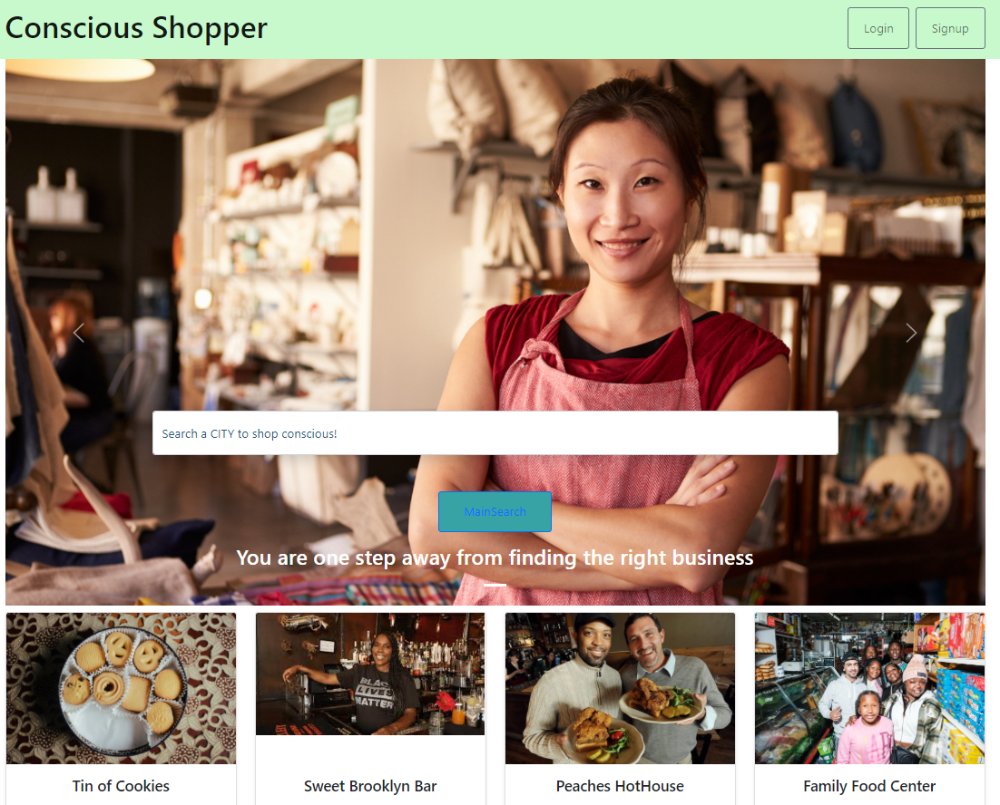
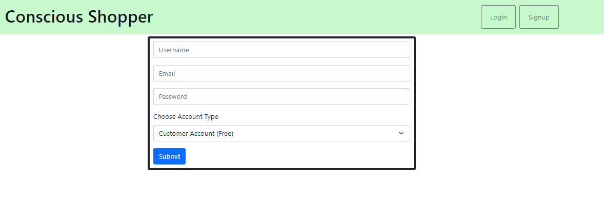
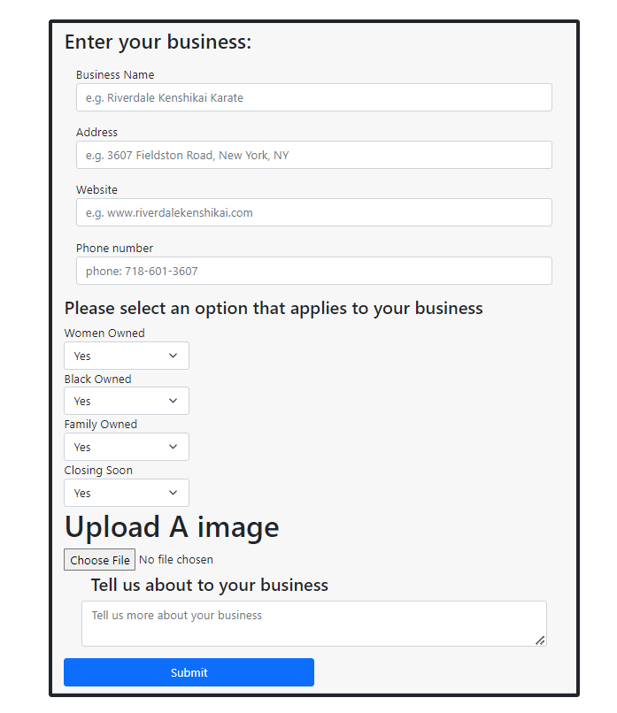
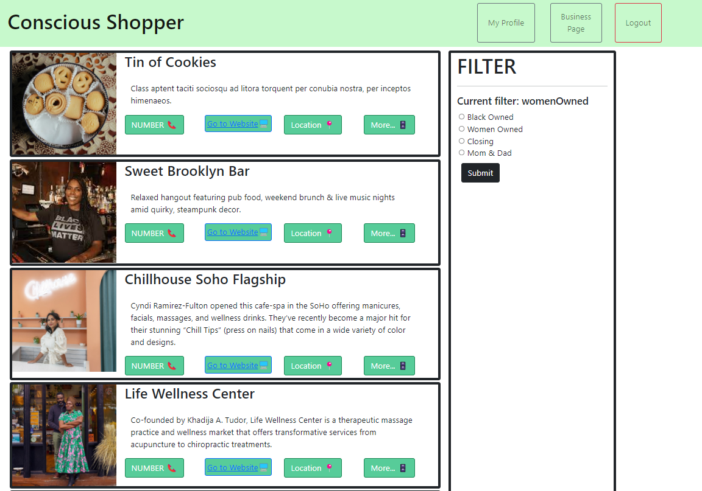

# Conscious Shopper

## Table of Contents
* [About the Project](#about-the-project)
* [Built With](#built-with)
* [Installation](#installation)
* [Usage](#usage)
* [Contributing](#contributing)
* [Acknowledgements](#acknowledgements)

## About the Project
Conscious Shopper is easy to use app that will let customers and business owners search, review, vote and share small family and minority owned businesses in their area.  This app is an SPA powered by MERN.

All customers will be able to search based on:
* Location
* Business type
* Status (small, family, minority, going out of business) 
    
Once the customer finds a desired business he/she will be able to view important information such as address, operation hours, listings, menu and share it.  Consumers will be able to leave comments and vote on businesses.

All business owners who purchase a business account will be able to add their business to the Conscious Shopper database including:
* Images
* Location
* Listing
* Operating hours

Business owners will be able to view comments about their business and respond to their consumers.

## Built With
* [React](https://es.reactjs.org/docs/getting-started.html)
* [GraphQL](https://graphql.org/)
* [Stripe](https://stripe.com/?utm_campaign=paid_brand-US_Search_Brand_Stripe-1803852691&utm_medium=cpc&utm_source=google&ad_content=448938759963&utm_term=kwd-279203062&utm_matchtype=p&utm_adposition=&utm_device=c&gclid=CjwKCAjwlcaRBhBYEiwAK341jeCBBQdH9R-Ykv7J5DxoXYTUg2FzLD1tUyafJISfNo-hYW0XNDnjKRoC8H8QAvD_BwE)
* [Apollo](https://www.apollographql.com/docs/)
* [Express.js](https://expressjs.com/)

## Installation
Follow these instructions to run Conscious Shopper locally:

First, clone or download the code base [here](https://github.com/mavisyupyup1/project-3-group-d).

From your CLI, navigate into the root directory, server, and client folders to install each of the packages. Run the following code block:

```
npm install
```

## Usage
To use Conscious Shopper online, visit [Conscious Shopper](https://enigmatic-basin-52191.herokuapp.com/). 

Search for businesses from the homepage.


To search for businesses or create a new business, visit the sign up page where you can select a free or paid profile.


As a business owner, once you have paid the subscription, you are taken to the business information page.


As a consumer, businesses can be filtered according to the specific types of small business in your area.


## Contributing
Conscious Shopper was built by group-D of Columbia Engineering's Full-Stack Coding Bootcamp.

Each person contributed concepts and code throughout the development process. Explore group-e's repositories to see what else we're up to:

* [Denva Emsley](https://github.com/Demsley1)
* [Grace Liu](https://github.com/mavisyupyup1)
* [Alvaro Oremeno](https://github.com/alvaroormeno)
* [Rebecca Byrne](https://github.com/RPB543)
* [John Harris](https://github.com/jharris92)


## Acknowledgements 
Group-D would like to thank our instructional team at Columbia Engineering Full-Stack Coding Bootcamp for their enduring support!

### Want to Help?
Do you see something we missed or a more succint and effective way this code can be written? Great! Please reach out to any of the contributors and let us know how we can improve. Thanks in advance for your tips, tricks, and pointers!
